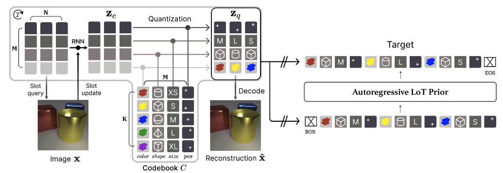

# Neural Language of Thought Models

Official code for [Neural Language of Thought Models](https://arxiv.org/abs/2402.01203) (*ICLR 2024*).



## Training

Training is done in two phases. First, the Semantic Vector-Quantized Variational Autoencoder (SVQ) is trained on images to obtain semantic discrete codes for each image. Then, the Autoregressive LoT Prior (ALP) is trained over these codes. To generate images, we sample from the ALP and use the sampled codes in the SVQ decoder.

### Dataset
The CLEVR datasets used in this paper were originally used in Neural Systematic Binder and can be found [here](https://drive.google.com/drive/folders/1FKEjZnKfu9KnSGfnr8oGVUBSPqnptzJc).

### Semantic Vector-Quantized Variational Autoencoder (SVQ)

To train SVQ:

```python train.py --data_path=/path/to/images/\*.png --log_path=/path/to/logs --fp16```

Use `data_path` to specify the directory of the images and `log_path` for the directory for the output logs and checkpoints. See `train.py` and `args.py` for a full list of arguments.

*Note:* When testing the code with the latest version of PyTorch (2.3.1), we noticed the model trains more stably on CLEVR-Easy using a lower learning rate for the encoder (`lr_enc=5e-5`) than originally reported in the paper.

### Autoregressive LoT Prior (ALP)

To train ALP:

```python train_prior.py --data_path=/path/to/images/\*.png --log_path=/path/to/logs --model_checkpoint_path=/path/to/svq/checkpoint/checkpoint.pt.tar --prior_data_dir=/path/to/prior/data/ --fp16```

Use `model_checkpoint_path` to specify the trained SVQ checkpoint. The initial run of `train_prior.py` will create a dataset of SVQ latents and store the data in the `prior_data_dir` directory. Subsequent runs will reuse the SVQ latents data in `prior_data_dir` if it has already been created. The `version` argument can be used to force re-creation of the SVQ latents which can be useful when testing different SVQ models.

## Acknowledgements
This code is adapted from the implementation of [Neural Systematic Binder](https://github.com/singhgautam/sysbinder).

## Citation
```bibtex
@inproceedings{
    wu2024neural,
    title={Neural Language of Thought Models},
    author={Yi-Fu Wu and Minseung Lee and Sungjin Ahn},
    booktitle={The Twelfth International Conference on Learning Representations},
    year={2024},
    url={https://openreview.net/forum?id=HYyRwm367m}
}
```
